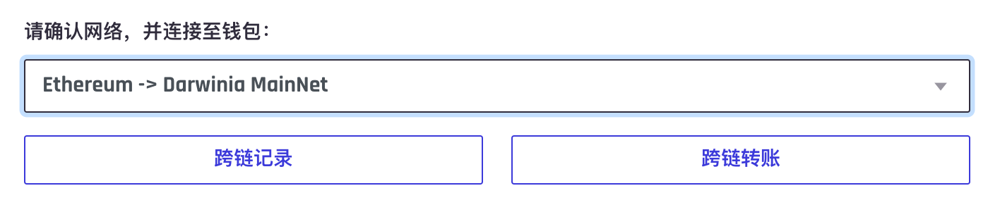
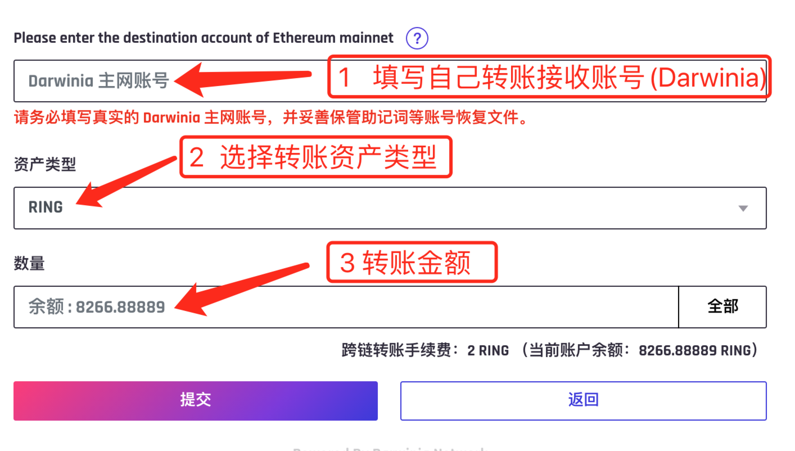
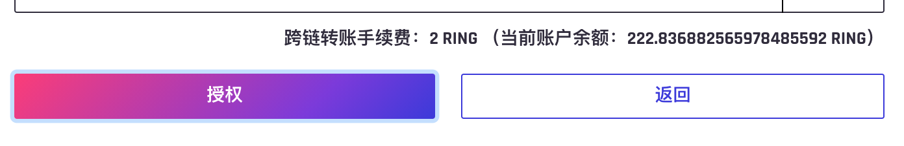
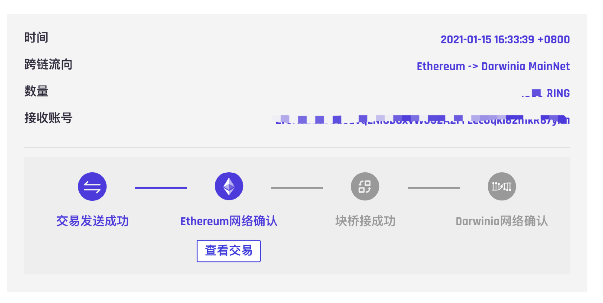

## 介绍
### 基本功能
虫洞是一个web-app，提供通过darwinia跨链桥用户转账的操作工具，用户根据自己的需要选择跨链桥，并使用自己的钱包向网络发送转账交易，工具实时显示账户的转账进度以及历史记录。所有操作都是去中心化的，数据在链上可查。
目前虫洞支持 Ethereum <=> Darwinia 网络之间的双向转账，在网页端使用Chrome浏览器，需要安装Polkadot以及metamask钱包
进入虫洞主页：https://wormhole.darwinia.network.com/

### Ethereum => Darwinia Mainnet
#### 操作过程
* 选择网络 为 `Ethereum -> Darwinia MainNet`，点击`跨链转账`按钮

* 填写转账三要素：目标地址，资产类型，转账金额
完成后点击`提交`按钮

注：第一次转账会首先请求`授权`如下

* 使用钱包向ethereum网络确认发送交易
* 此时点击`跨链记录`按钮，可以观察到自己的转账进度

等待Ethereum交易确认后，桥矿工会将转账交易自动发送到Darwinia网络，网络确认后转账完成

#### 跨链流程
* 用户向Ethereum跨链合同存入资产，将资产在Ethereum上销毁，该交易将作为用户存入资产的凭证。此时虫洞上显示Ethereum网络已确认，并可查交易链接。
* 桥矿工收到事件后向Darwinia网络提交Ethereum交易所在区块的mmr_proof。
* 该证明会在一定时间之后被Darwinia确认，在这期间错误的或者无效的证明会被其他桥矿工证伪。当该证明被确认后，此时虫洞显示块桥接成功。
* 此时桥矿工会再次使用用户在Ethereum上的交易凭证和Darwinia上确认之后的mmr_proof为用户提取资产，此时虫洞显示Darwinia网络已确认。用户资产到账。

### Darwinia Mainnet => Ethereum
#### 操作过程
* 选择网络 为 `Darwinia MainNet -> Ethereum`，点击`跨链转账`按钮

* 选择发送和接收

* 钱包确认交易发送
* 点击`跨链记录`查看转账进度，等待网络确认成功后点击`领取`

* Ethereum钱包确认领取

#### 跨链流程
* 用户确认跨链转账后，资产通过交易被锁定在Darwinia网络，此时虫洞显示Darwinia网络已经确认
* authorities收到转账事件后，对高于转账交易所在区块的某个区块的MMR_ROOT做联合签名，当签名达到设定门限后，用户可以向Darwinia请求签名以及区块的MMR_PROOF和交易的Merkle_proof，此时虫洞显示待领取状态。
* 用户点击领取按钮，将交易的proof和mmr_root签名一同发向Ethereum网络提取转账资产。

整个流程实际完成三件事
1、用户锁定Darwinia上的资产
2、authorities向Ethereum证明锁定资产交易所在区块的有效性
3、用户向Ethereum证明交易的有效性并提取资产

