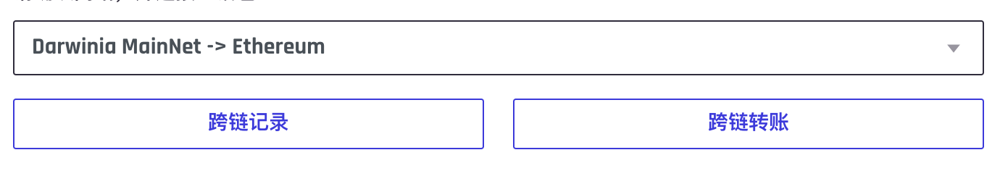
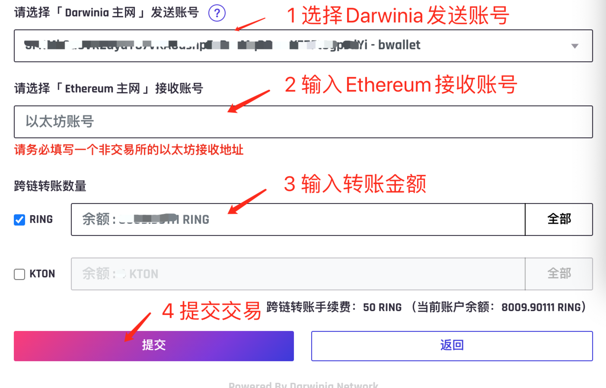
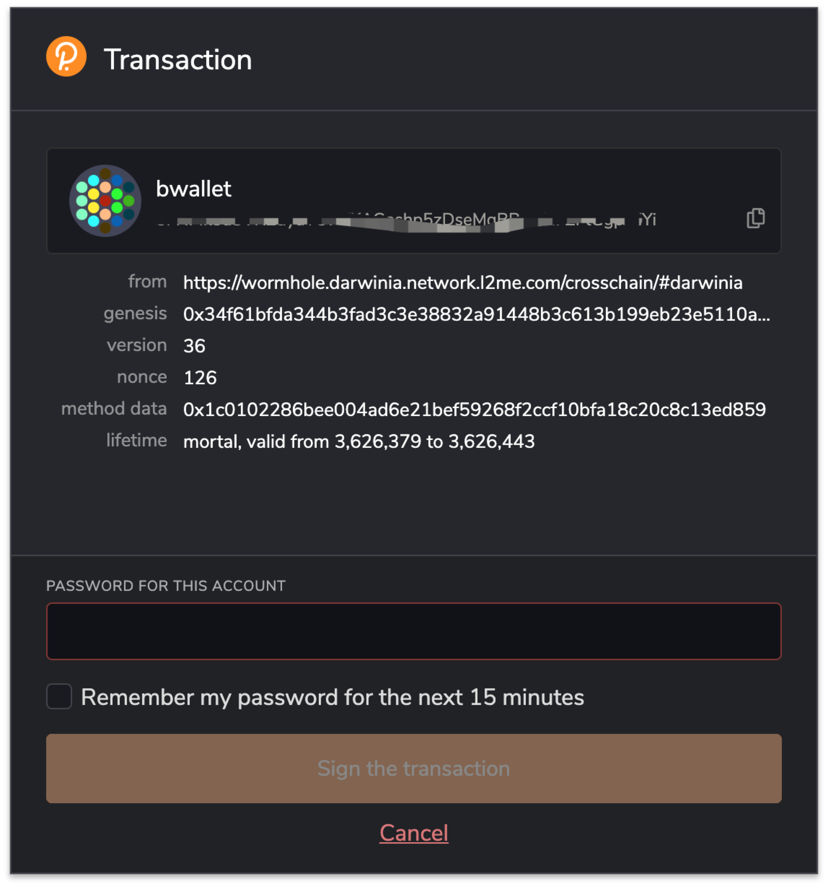
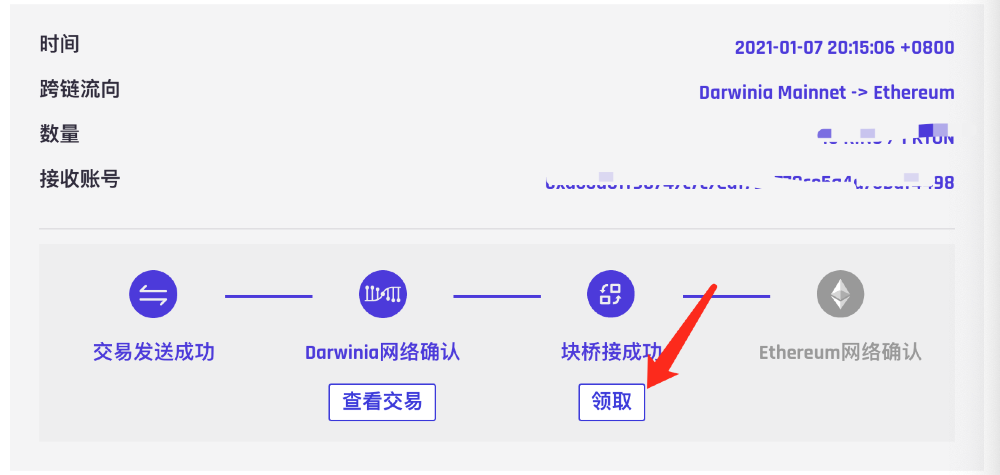
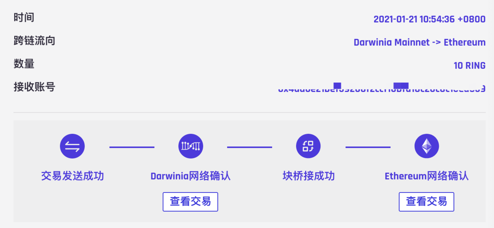

[English](./bridge_en.md)
### 基本功能
虫洞是一个web-app，提供通过darwinia跨链桥用户转账的操作工具，用户根据自己的需要选择跨链桥，并使用自己的钱包向网络发送转账交易，工具实时显示账户的转账进度以及历史记录。所有操作都是去中心化的，数据在链上可查。
目前虫洞支持 Ethereum <=> Darwinia 网络之间的双向转账，在网页端使用Chrome浏览器，需要安装Polkadot以及metamask钱包

### Darwinia Mainnet => Ethereum
#### 操作过程
1、 打开虫洞主页 https://wormhole.darwinia.network.com

2、 点击悬浮球`Darwinia`，此时悬浮球`Ethereum`下方会显示`跨链转账`按钮，然后点击`跨链转账`按钮进入转账页面。

3、 进入转账页面后，第一步需要选择正确的网络，下拉框选择网络为 `Darwinia MainNet -> Ethereum`，表示资产将从Darwinia主网转入Ethereum网络，点击`跨链转账`按钮，进入账号设置页面。

4、 用户资产将从Darwinia主网的发送账号转移至Ethereum的接收账号，下拉框选择正确的Darwinia主网发送账号，编辑框填写正确的Ethereum接收账号(0x开头的地址)，并勾选需要转账的通证，填写转账金额

5、 确认账号以及金额设置无误后点击`提交`按钮，此时会弹出polkadot钱包确认转账交易，输入钱包密码并点击`签名交易`

6、至此，Darwinia网络端的交易已经发出，再次进入第3步转账页面，点击`跨链记录`查看转账进度，虫洞会记录并显示该交易的链接(可能存在一定的延时，如果没有显示该转账交易，刷新一下试试)，用户可以点击并查看交易执行结果，等待Darwinia网络确认成功后会显示`领取`按钮，此时资产已经从Darwinia网络转移至Ethereum网络，用户需要进入下一步提取到自己的钱包。

7、点击`领取`按钮，在弹出的Metamask钱包确认领取转移到Ethereum上的资产，等待交易在链上确认后，资产转入用户地址（注意该地址是用户在第4步指定的接收账号地址），完成跨链转账

