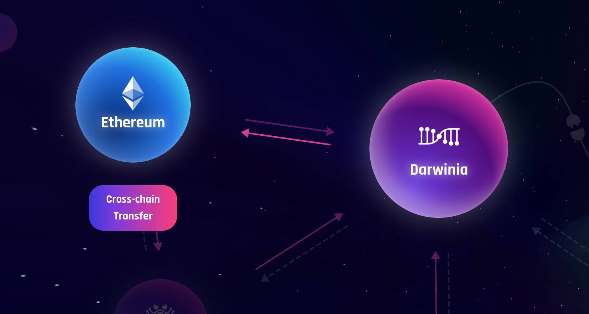
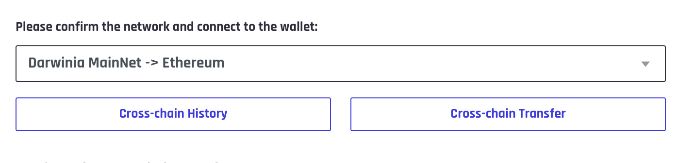
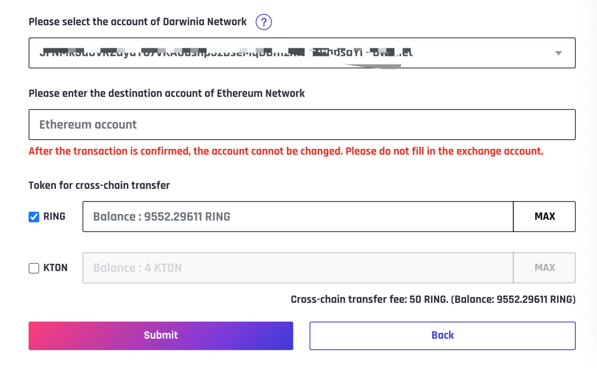
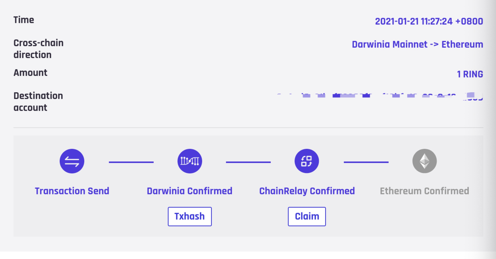

### Intruduction
Wormhole is a web application, it provide some tools to help users to do cross-chain operations. Users select bridgers and by using their own wallet to transfer their token from one chain to another. And the tool displays transfer process and its history in real time. Each operation is decentralized, and all the data can be found on the chain.
People can transfer token from Darwinia network to Ethereum network by using wormhole on Chrome. And it requires Polkadot and Metamask wallet plugin.

### Darwinia Mainnet => Ethereum
#### Operations
* Open wormhole homepage https://wormhole.darwinia.network.com
* Click `Darwinia`，then click `Cross-chain Transfer` under the `Ethereum` icon.

* In the `Cross-chain Transfer` page, select `Darwinia MainNet -> Ethereum`, and click `Cross-chain Transfer` button.

* Select your account of Darwinia Network, and enter the right destination account of Ethereum Network(must start with `0x`), select token and enter amount.

* Click `Sumbit` button, it will popup polkadot wallet. Then enter password and click `Sign the transaction`.

Now, you have finished more than half of the process, wait for Darwinia Network's confirmation.

* Click `Cross-chain History` to query the transfer process. You can find the active `Claim` button when Darwinia Network confirmed.

* Click `Claim` button, it'll popup Metamask wallet. Confirm the transaction to claim your token.
* Wait for the transaction confirmed, the whole cross-chain transfer completed. You can query transaction history at every stage.

